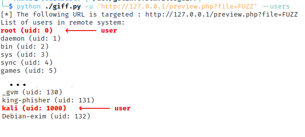
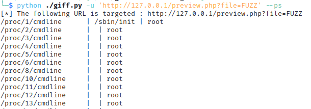
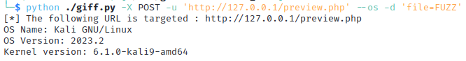
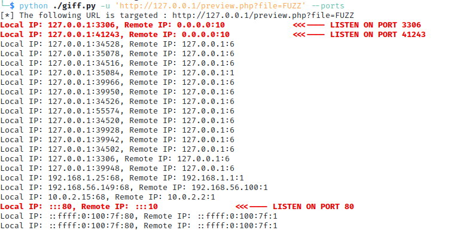

# GIFF

Author: Anthony Dessiatnikoff

It allows to display information about remote systems using a Local File Include vulnerability.
Targets: Linux only (for now)
It is not an exploit! It only extract information from some files on the target.

- list of users on the system :

- list of executed processes

A CSV file with all processes will be created for convenience.

- OS version :

- list of TCP/UDP Connections for IPv4 and IPv6 :
  

## TODO

- Encoding (base64, ...)
- More advanced inclusion
- Use of a request file (with -r)

## DISCLAIMER

This tool is intended for use only on systems that you own or have explicit authorization to test.
DO NOT USE this tool without proper authorization.
You assume all risks associated with its use.
The creator of this tool will not be held liable for any actions performed with it.
